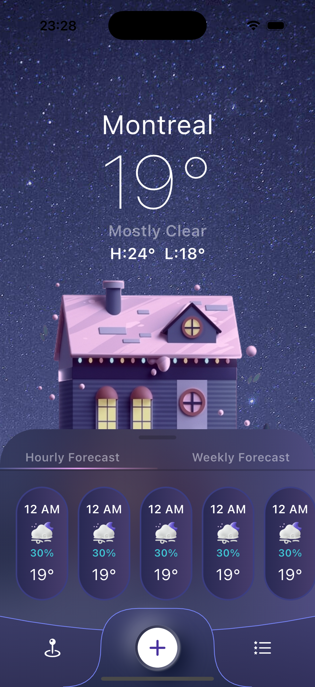

# 📱 Weatherly

**Weatherly** — pet-project мобильного приложения для просмотра погоды, разработанный с использованием **Flutter**.

---

# 🎨 Design

UI дизайн взят из **Figma Community**.

🔗 [Weatherly – Simple Weather Mobile App UI Kit](https://www.figma.com/design/WdeGdApJ4zDHGD9gPFKOKL)

---

# 🚀 Purpose of the Project

Этот проект создан для:

- практики **Flutter UI разработки**
- работы с **кастомными формами и клипперами**
- реализации **современного mobile UI**
- улучшения навыков **архитектуры Flutter приложений**
- практики **чистой структуры проекта**

---

# 📸 Preview

  

